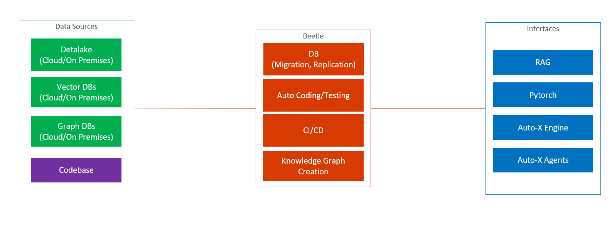
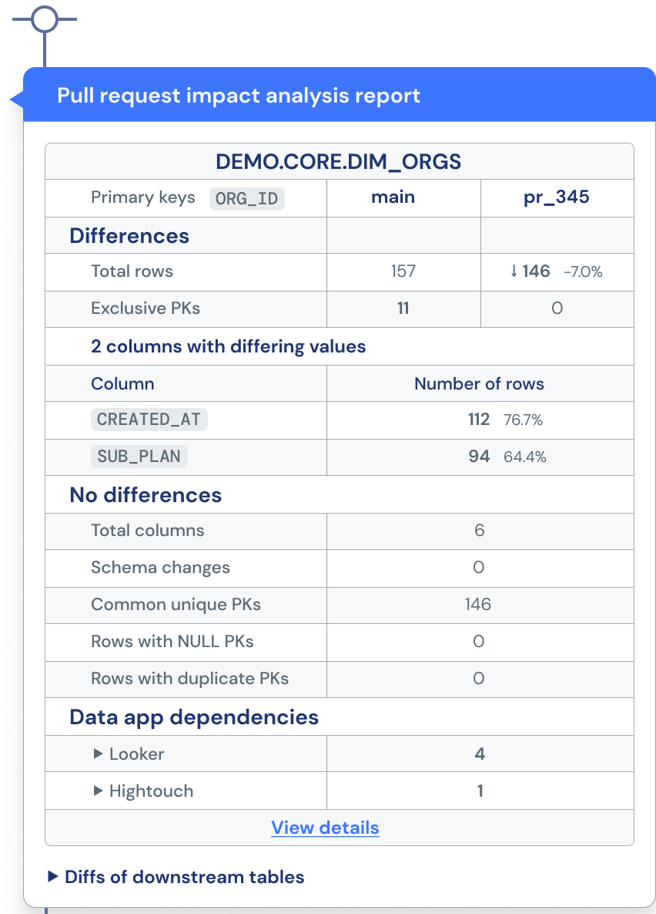

# Beetle

This project is powered by [PROON株式会社](https://proon.co.jp). 
The Beetle has been widely used by big bankers in Japan.
This repo is the community version of the next generation of Beetle.

<div  align="center">
  
</div>

## Features
- Connects with different kinds of databases, such as MySQL, Snowflake, Deeplake, vector DBs and graph DBs.
- Automates full development processes (such as design, coding, testing, CI/CD, Data Migration, and Data Replication) using UI interfaces
- Automates knowledge graph creation process using UI interfaces
- Provides interfaces for AI solutions

## Development Automation

### Database compare, merge, and edit

<div  align="center">
  
</div>

### Data audit

<div  align="center">
  
</div>

### CI/CD

<div  align="center">
  
</div>


### Coding

### Testing

## Knowledge Creation


## AI Interfaces


## Prerequisites

 - Node.js `>= 18.17.0` and `< 21`.
   - If you are interested in VS Code Extension support then you should use a Node version at least compatible with the one included in the version of Electron used by [VS Code](https://github.com/microsoft/vscode).
 - [Yarn package manager](https://yarnpkg.com/en/docs/install)  `>= 1.7.0` **AND** `< 2.x.x`.
 - git (If you would like to use the Git-extension too, you will need to have git version 2.11.0 or higher.)
 - Python3 is required for the build due to [`node-gyp@8.4.1`](https://github.com/nodejs/node-gyp/tree/v8.4.1#installation)

Some additional tools and libraries are needed depending on your platform:

- Linux
  - [make](https://www.gnu.org/software/make/)
  - [gcc](https://gcc.gnu.org/) (or another compiling toolchain)
  - [pkg-config](https://www.freedesktop.org/wiki/Software/pkg-config/)
  - build-essential: `sudo apt-get install build-essential`
  <a name="prerequisite_native_keymap"></a>
  - [`native-keymap`](#prerequisite_native_keymap) native node module dependencies:
    - Debian-based: `sudo apt-get install libx11-dev libxkbfile-dev`
    - Red Hat-based: `sudo yum install libX11-devel.x86_64 libxkbfile-devel.x86_64 # or .i686`
    - FreeBSD: `sudo pkg install libX11`
  <a name="prerequisite_keytar"></a>
  - [`keytar`](#prerequisite_keytar) native node module dependencies ([reference](https://github.com/atom/node-keytar#on-linux)):
    - Debian/Ubuntu: `sudo apt-get install libsecret-1-dev`
    - Red Hat-based: `sudo yum install libsecret-devel`
    - Arch Linux: `sudo pacman -S libsecret`
    - Alpine: `apk add libsecret-dev`

- Linux/MacOS
  - [nvm](https://github.com/nvm-sh/nvm) is recommended to easily switch between Node.js versions.

- Windows
  - We recommend using [`scoop`](https://scoop.sh/). The detailed steps are [here](#building-on-windows).

## Quick Start

To build and run the browser example:

```sh
yarn 
yarn download:plugins
yarn browser build
yarn browser start
```

Start your browser on http://localhost:3000.

### Run the browser example with SSL

To run the browser example using SSL use:

```sh
yarn
yarn browser build
yarn download:plugins
yarn browser start --ssl --cert /path/to/cert.crt --certkey /path/to/certkey.key
```

Start your browser on https://localhost:3000.


## References

- [Eclipse Theia](https://github.com/eclipse-theia/theia)
- [data-diff](https://github.com/datafold/data-diff)
- [Snowflake Connector for Python](https://github.com/snowflakedb/snowflake-connector-python)
- [Deep Lake](https://github.com/activeloopai/deeplake)